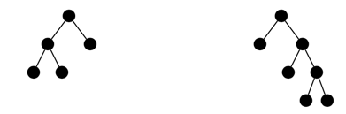

# Introducción

Este es un proyecto propuesto por 99Minutos a modo de Desafío Técnico. 
La solución consiste en un proyecto php, desarrollando una API utilizando Lumen 7, estructurada por dominios e implementada de manera "agnóstica" al framework.

# Arquitectura

La arquitectura del proyecto esta basada por los fundamentos de Lumen, a la cual se agregó la sección app/Core en donde se encuentran los diferentes dominios con sus servicios, lógica del negocio y modelos. 

En el archivo routes/web.php se encuentran las definiciones de los diferentes endpoints.

# Casos de uso

- Retornar la altura de un Árbol Binario, dada una lista de enteros. 
- Retornar los nodos vecinos del nodo que contiene el entero dado.
- Retornar la búsqueda en anchura (BFS) del árbol binario.

# API

### Retornar la altura de un Árbol Binario, dada una lista de enteros:

```http
POST /v1/b-trees/height
```
| Parámetro | Tipo | Descripción |
| :--- | :--- | :--- |
| `toTree` | `list` | **Requerido**. Lista de enteros, a partir de la cuál se construirá el árbol binario. |
En este endpoint se realizan las siguientes tareas:
- Construir el árbol binario.
- Calcular su altura máxima
  
La altura de un árbol binario se define recursivamente de la siguiente manera:
- si el árbol es vacío su altura es 0
- si el árbol no es vacío su altura es 1 más que el máximo de las alturas de sus hijos.
  
De los siguientes árboles, el de la izquierda tiene altura 3 y el de la derecha tiene altura 4.



#### Respuesta:

```json
{
    "height": <entero-que-representa-altura>
}
```

### Retornar los nodos vecinos del nodo que contiene el entero dado:
```http
POST /v1/b-trees/neighbors
```
| Parámetro | Tipo | Descripción |
| :--- | :--- | :--- |
| `toTree` | `list` | **Requerido**. Lista de enteros, a partir de la cuál se construirá el árbol binario. |
| `node`   | `int` | **Requerido**. Número entero que representa el id de un nodo. |
En este endpoint se realizan las siguientes tareas:
- Construir el árbol binario.
- Buscar el nodo identificado por el entero `node`.
- Encontrar los identificadores de los nodos a su izquierda y derecha respectivamente.

#### Respuesta:
```json
{
    "neighbors": [
        "left": <número-entero-identificador-de-un-nodo>,
        "right": <número-entero-identificador-de-un-nodo>
    ]
}
 ```

### Retornar la búsqueda en anchura (BFS) del árbol binario:
```http
POST /v1/b-trees/bfs
```
| Parámetro | Tipo | Descripción |
| :--- | :--- | :--- |
| `toTree` | `list` | **Requerido**. Lista de enteros, a partir de la cuál se construirá el árbol binario. |

En este endpoint se realizan las siguientes tareas:
- Construir el árbol binario.
- Recorrer el árbol desde la raíz utilizando el algoritmo de búsqueda en anchura.
- Retornar los identificadores de los nodos, en el orden en que fueron recorridos.

#### Respuesta:
```json
{
    "bfs": [
        <identificador-de-nodo>,
        ...
    ]
}
 ```

# Puesta en marcha

Requerimientos de instalación:

| Requerimientos | Versión |
| :--- | :--- |
|  | 7.2 o superior. |  
|  | 2.0 o superior. |  

Una vez instalados los requerimientos ejecutar los siguientes comandos, en la carpeta raíz del mismo.
```
  composer install
  php -S localhost:8000 -t public
```

Luego podrá utilizar los endpoints mencionados en la documentación, utilizando:

```
127.0.0.1:8000/{uri-del-endpoint-requerido}
``` 

#### Se puede descargar la colección de endpoints para postman desde [este link](https://www.getpostman.com/collections/09218a178ba73c0830aa).
